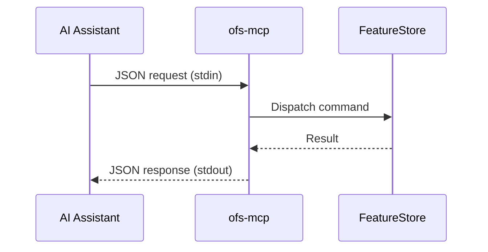

# MCP Server Overview

The MCP (Model Context Protocol) server allows OpenFeatureStore to be used as a
tool provider by AI assistants.

## Architecture

The MCP server uses a simple JSON-over-stdin/stdout protocol:



## Running the Server

```bash
# Direct invocation
ofs-mcp

# With input from echo
echo '{"tool": "init", "args": {"project": "demo"}}' | ofs-mcp

# With input from file
ofs-mcp < request.json
```

## Available Tools

| Tool | Description |
|---|---|
| `init` | Initialize feature store |
| `apply_entity` | Register an entity |
| `apply_feature_view` | Register a feature view |
| `list_entities` | List registered entities |
| `list_feature_views` | List registered feature views |
| `materialize` | Materialize features |
| `online_read` | Read features online |
| `online_write` | Write features online |
